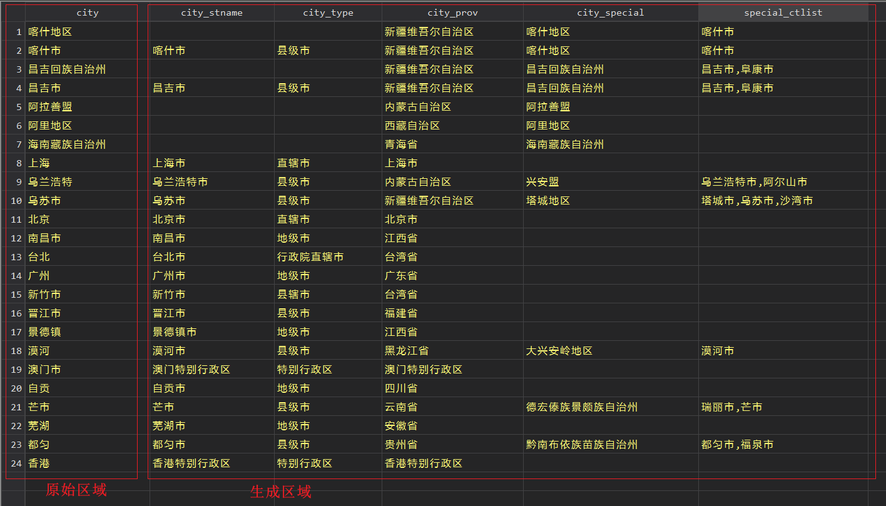

# cncity

A Stata command for Chinese city name standardization.

## Install

```stata
* Latest version
cap ado uninstall cncity
net install cncity, from("https://raw.githubusercontent.com/codefoxs/cncity/main/") replace

* Old versions
cap ado uninstall cncity
net install cncity, from("https://raw.githubusercontent.com/codefoxs/cncity/v#.#.#/") replace
```

## Quick use

```stata
cncity city
```

## Variables

`city_stname`: 标准城市名称，必须以“市”结尾

`city_type`: 城市类型，如地级市、县级市、直辖市等

`city_prov`: 城市所属省份，如果是直辖市则为本身

`city_special`: 一些特殊需求的匹配，如地区、自治州、盟

`special_ctlist`: 特殊地区城市名单

## Example


