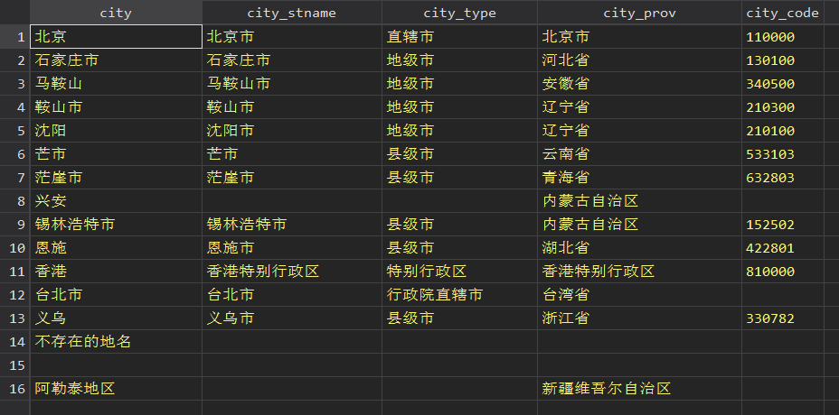

# cncity

A Stata command for Chinese city name standardization.

## Install

```stata
* Latest version
cap ado uninstall cncity
net install cncity, from("https://raw.githubusercontent.com/codefoxs/cncity/main/") replace

* Old versions
cap ado uninstall cncity
net install cncity, from("https://raw.githubusercontent.com/codefoxs/cncity/v#.#.#/") replace
```

## Quick use

```stata
* 基本用法
cncity city

* 覆盖已生成的变量重跑
cncity city, replace

* 额外输出地区/自治州/盟相关变量（city_special、special_ctlist）
cncity city, detail        // 可缩写为 , d

* 支持 if/in 限定
cncity city if year == 2020, replace
```

运行结束会报告匹配统计（匹配到城市 / 仅匹配到地区州盟 / 未匹配的观测数）。

## Variables

`city_stname`: 标准城市名称，必须以“市”或“特别行政区”结尾

`city_type`: 城市类型，如地级市、县级市、直辖市等

`city_prov`: 城市所属省份，如果是直辖市则为本身

`city_code`: 六位行政区划代码（GB/T 2260），地级市为 `XXXX00`，县级市为完整六位；港澳为 `810000`/`820000`，台湾城市无国标代码留空

`city_special`（仅 `detail` 选项）: 一些特殊需求的匹配，如地区、自治州、盟

`special_ctlist`（仅 `detail` 选项）: 特殊地区城市名单

## Test

```stata
* 在仓库文件夹内运行回归测试，全部通过显示 ALL TESTS PASSED
do test_cncity.do
```

## Example


